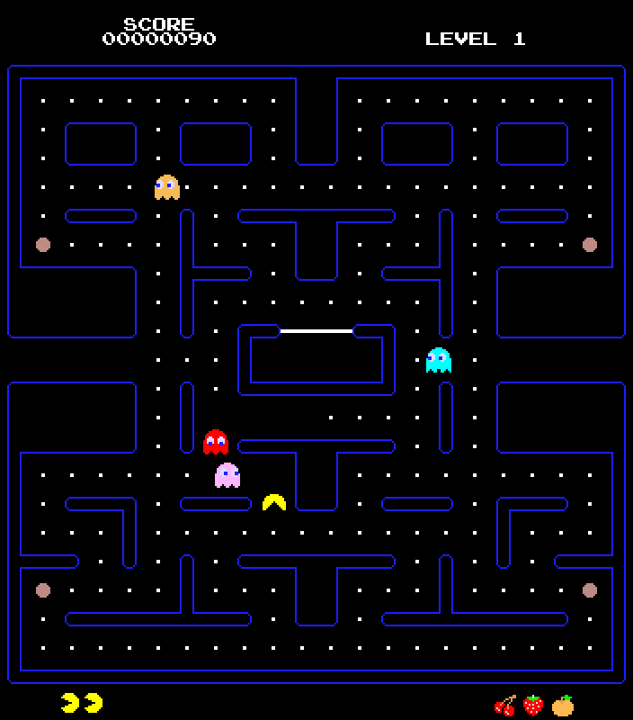

# Pac-Man Implementation in Lua

As Edwin Brady said on episode six of the [CoRecursive Podcast](https://corecursive.com/):
> I think it is a much more interesting property of a practical programming language
> that you can write Pac-Man in it than that you could solve any computable problem in it.

Whitespace is Turing complete, Microsoft PowerPoint is Turing complete, and the Lambda Calculus is also Turing complete.
Even though these tools are just as capable as Lua, they are not Pac-Man complete - you would not want to write Pac-Man in them.

This project is meant to demonstrate that Lua is Pac-Man complete. In addition, it is meant to be used as a reference implementation so that other languages can
be tested for Pac-Man completeness without having to redesign algorithms or assets (much).

Pac-Man completeness is an excellent metric of a programming language's usefulness, as Pac-Man is neither too complicated nor too simple of a program.
Simple examples fail to show the strengths and weaknesses of languages. To see how a programming language is used in a medium-scale project, a medium-scale
reference must be consulted. 

## Running

To start the game first install [LÖVE2D](https://love2d.org/).
Then, clone this repository and run `love` in its root directory.
